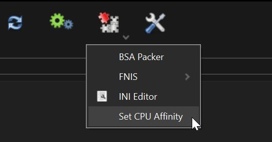

Beowulf ist eine von Grund auf neu erstellte Modliste für High-End PCs mit Fokus auf grafischer Aufwertung, Immersion und etwas Gameplay-Verbesserungen. Mein Ziel war es, ein lore-freundliches Vanilla+ Erlebnis zu schaffen, das optisch einem Next-Gen Spiel nahe kommt und den "Geist von Skyrim" zu erhalten.
Daher wurden keine neue Gebiete und (riesige) Quests hinzugefügt. Auch Waffen und Rüstungen wurden nur hinzugefügt, wenn diese in das Look&Feel des Spiels passen.

## Hauptfeatures

- Immersiv und lore-freundlich (aber ohne Survival Mode)
- Streamer-freundlich: Vanilla-Musik und keine Sexmods
- Einsatz von HD Texturen inkl. Parallax
- High Poly Head NPCs
- Rudy ENB mit Obsidian Weathers and Seasons
- Lux + Lux Via + Lux Orbis
- Überarbeitung von Städten und Interieur (JKs, COTN, The Great Cities/Towns, etc.)
- Dichte Wälder und malerische Landschaften (Tree Diversity Project, Nolvus Grass Mashup)
- Lore-freundliche Änderungen der Rassen (Aetherius)
- Leicht überarbeitetes Skill System (Adamant, Scion, Growl)
- Überarbeitung des Kampfsystems (Valhalla Combat)
- Kann sowohl in 1st Person als auch in 3rd Person Perspektive gespielt werden
- Die erste deutsche Modliste für Wabbajack :)

## Voraussetzungen

- **Deutsches** Skyrim SE **1.6.1170** auf Steam. Keine Unterstützung für VR, XBOX oder GOG!
- Nexus PREMIUM Account (DRINGEND EMPFOHLEN, wenn du nicht ~1600 Mods manuell installieren willst)
- **~290 GB** freier (M.2) **SSD** Speicherplatz: 170 GB Download Ordner + 120 GB Modliste

## Vorbereitungen

Bevor die Modliste installiert werden kann, müssen folgende Schritte durchgeführt werden:

1. Installiere [Visual C++ Redistributable (x86)](https://aka.ms/vs/17/release/vc_redist.x86.exe) und [Visual C++ Redistributable (x64)](https://aka.ms/vs/17/release/vc_redist.x64.exe)
2. Installiere die _Run desktop apps_ Version von [Microsoft .Net 6.0 Runtime (x64)](https://dotnet.microsoft.com/en-us/download/dotnet/6.0/runtime) und [Microsoft .Net 7.0 Runtime (x64)](https://dotnet.microsoft.com/en-us/download/dotnet/7.0/runtime).
3. Stelle sicher, dass du eine neue Installation von Skyrim Version 1.6.1170 auf Steam hast.
Skyrim muss komplett frisch installiert werden! Auch der Skyrim Special Edition Order in \Documents\My Games muss gelöscht werden!
Außerdem darf Skyrim NICHT in "_Programme_" oder in Windows-Standardordnern wie "_Desktop_" oder "_Downloads_" installiert werden. Am besten ist es, wenn du eine andere Partition nutzt.
4. Nach der Neuinstallation Skyrim einmal starten und _Creations_ Menü aufrufen und die vier SE Creations herunterladen: [Fishing](https://creations.bethesda.net/de/skyrim/details/5615/Fishing), [Survival Mode](https://creations.bethesda.net/de/skyrim/details/5618/Survival_Mode), [Saints & Seducers](https://creations.bethesda.net/de/skyrim/details/5619/Saints___Seducers), [Rare Curios](https://creations.bethesda.net/de/skyrim/details/5617/Rare_Curios). Dann Skyrim wieder beenden.
5. [Skyrim Special Edition: Creation Kit](https://store.steampowered.com/app/1946180/Skyrim_Special_Edition_Creation_Kit/) auf Steam herunterladen
6. (optional) Deaktiviere die [Auto-Update Funktion](https://www.youtube.com/watch?v=GyOFgSwWd7I)

### Auslagerungsdatei vergrößern

Große Modlisten benötigen viel Arbeitsspeicher. Wenn nicht genug Speicher vorhanden ist, kann es sein, dass ein Systemabsturz auslöst wird. Dies kann durch eine Vergrößerung der Auslagerungsdatei behoben werden:

1. Drücke **Win + R** und gib folgendes ein: **sysdm.cpl ,3**
2. Im Tab **Erweitert**, unter **Leistung** den Button **Einstellungen...** drücken
3. Im neuen Fenster dann wieder auf den Tab **Erweitert** gehen und unten den Button **Ändern...** klicken
4. **Dateigröße für alle Laufwerke automatisch verwalten** deaktivieren
5. Laufwerk auswählen, auf dem Skyrim installiert ist.
6. Unter **Benutzerdefinierte Größe** Anfangsgröße (MB) und Maximale Größe (MB) auf **40960** setzen.
7. Klicke auf **Festlegen**
8. Klicke auf **OK**
9. Klicke auf **Übernehmen** und dann auf **OK**
10. Jetzt den PC neu starten

##  Installation

Downloade und installiere die [aktuellste Version von Wabbajack](https://www.wabbajack.org/).
Installiere das Programm in einem Ordner in der Nähe oder im Stammverzeichnis deines Laufwerks, z. B. `D:\Wabbajack`. Wabbajack darf nicht in "_Programme_" oder in Windows-Standardordnern wie "_Desktop_" oder "_Downloads_" installiert werden.

Jetzt kann Beowulf installiert werden:

1. Starte die `Wabbajack.exe`
2. Wähle `Browse Modlists` aus
3. Klicke oben auf `Show Unofficial Lists`
4. Gib oben im Suchfeld `Beowulf` ein
5. Klicke auf den Download Pfeil.\
   Du wirst automatisch auf den nächsten Screen weitergeleitet, wenn der Download fertig ist.
6. Setze als `Installation Location` einen Ordner in der Nähe des Stammverzeichnisses deines Laufwerks (z.B. D:\Modlists\Beowulf).\
   Achte wieder darauf, dass du - wie bei Wabbajack - keinen geschützen Ordner benutzt.
7. Klicke auf den `Play` Button.\
   Wenn du keinen Nexus Premium Account hast, musst du MANUELL jeden Mod-Download bestätigen!
   Beowulf hat ungefähr 1600 Mods. Daher empfehle ich dringend einen Nexusmods Premium Account.
8. Warte, bis die Installation abgeschlossen ist. Je nach Internet-Geschwindigkeit kann dies mehrere Stunden dauern.
9. Füge den Wabbajack und Beowulf Ordner als Ausnahme in dein Anti-Virus Programm hinzu. AV Programme flaggen MO2 fälschlicherweise (siehe [hier](https://www.nexusmods.com/skyrimspecialedition/mods/6194)) wegen des Virtuellen File Systems.

#### Probleme mit Wabbajack
Es gibt viele verschiedene Szenarien, in denen Wabbajack mit einem Fehler abbricht. Das kann verschiedene Ursachen haben.
Einige Dateien können sehr groß sein oder werden nicht auf Nexusmods gehostet.
Ich empfehle, Wabbajack zu schließen und neu zu starten, bevor du etwas postest. Wabbajack macht dort weiter, wo es aufgehört hat.
Versuche, die Option "Netzwerk-Workaround" in den Wabbajack-Einstellungen zu aktivieren (Zahnradsymbol oben rechts). Wenn dies das Problem nicht behebt, versuche dich mit einem VPN zu verbinden und Wabbajack erneut zu starten.

##  Nach der Installation

Neben einigen anderen Dingen hat Wabbajack auch Mod Organizer 2 installiert. Skyrim wird nun nicht mehr über Steam, sondern ausschließlich über Mod Organizer 2 gestartet.

1. Öffne den Installationsordner und starte **ModOrganizer.exe**
2. Es kann sein, dass sich Dialoge öffnen (.nxm Links mit MO2 öffnen; Game Registry Path updaten). Beides sollte mit Yes bestätigt werden.
3. Jetzt musst du noch die CPU Affinity einstellen. Dazu oben auf das Puzzle klicken und "Set CPU Affinity" auswählen:\

4. Überprüfe, ob das Dropdown-Feld auf der rechten Seite auf `Beowulf starten [SKSE]` eingestellt ist und drücke dann auf Run.
5. Du kannst auch einen Desktop Shortcut erstellen, indem du **Shortcut** auswählst.

##  Updaten der Modliste

Bevor du ein Update durchführst, prüfe bitte das Changelog und **sichere deine Spielstände**. Nach bestimmten Updates musst du vielleicht ein neues Spiel anfangen.

Generell gilt:
- **Full Update** x.0 (2.0, 3.0, etc.) Update erfordert ein neues Spiel.
- **Major Update** x.x (2.1, 2.2 usw.) Update erfordert ein neues Spiel.
- **Minor Update** x.x.x (2.1.1, 2.1.2) Update kann auf ein laufendes Spiel angewendet werden.
 
Ein Update ist wie eine Neuinstallation der Liste. Kontrolliere, ob die Pfade übereinstimmen und aktiviere in Wabbajack die Schaltfläche `Overwrite Installation`.\
Hinweis: **Alle Mods, die du manuell hinzugefügt hast, werden bei der Aktualisierung gelöscht!** Dein Downloads Ordner bleibt davon aber unberührt.

## Spenden

> "Ich habe geschuftet wie ein Irrer, damit ich Euch diese feinen Waren anbieten kann." - Tashun der Bergmann

Es hat sehr viel Zeit und Arbeit gekostet, diese Collection zu erstellen. Was zuerst als kleines Nebenprojekt begann, hat letztendlich über 1.5 Jahre in Anspruch genommen.
Hauptproblem war (und ist), dass es für viele Mods keine deutsche Übersetzung gab/gibt. Viele Mods musste ich daher selbst übersetzen.
Auch Patches sind nicht immer vorhanden, da diese auf bestimmte Mod-Kombinationen angepasst sind. Zudem werden einige Mods nicht mehr geupdated, wodurch Bugs entstehen können.
Bethesda hat in dieser Zeit drei Updates herausgebracht, die meine Modliste für Monate unspielbar gemacht haben.

Es war (und ist) daher eine Menge Arbeit, Übersetzungen anzufertigen, Patches zu erstellen, Bugs zu beheben und die Modliste zu pflegen. Ich mache das alles alleine und in meiner Freizeit, neben Job und Familie.

Wenn ihr mich unterstützen wollt, freue ich mich über eine jede noch so kleine Spende:

<a href='https://ko-fi.com/X8X8P2AUR' target='_blank'>

Natürlich freue ich mich auch über ein einfaches Dankeschön, konstruktives Feedback, oder ein paar Screenshots/Videos aus der Modliste :)

